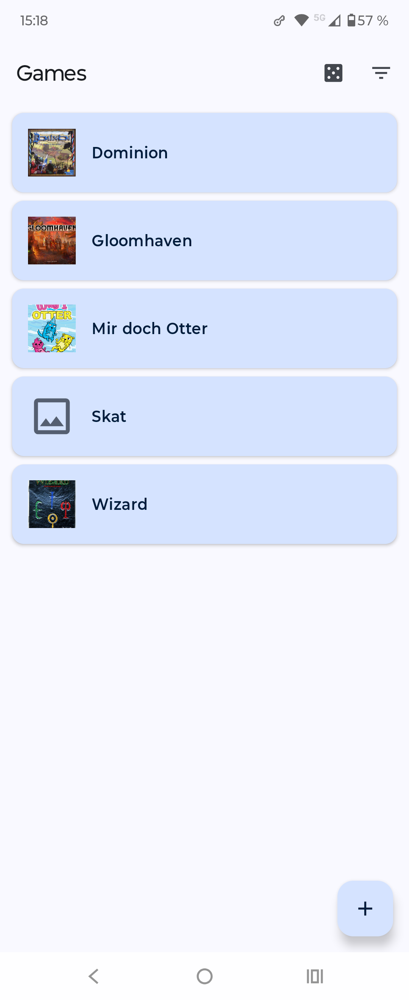
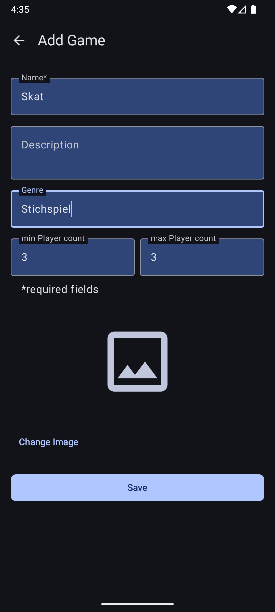

# List Randomizer

A modern Android application designed to help you manage your board game collection and pick the perfect game for any occasion.

## 🤔 What's the Purpose?

Ever have trouble deciding what to play on game night? List Randomizer is here to help! This app is designed for board game enthusiasts to catalog their collection. You can easily filter your games by the number of players or genre to see exactly what's suitable for your group. And for those moments of indecision, the app can pick a random game from the (filtered) list for you.

*(Further features are planned)*

## Screenshots

|                HomeScreen                 |             Item Entry View              |                   Detail View                   |
|:-----------------------------------------:|:----------------------------------------:|:-----------------------------------------------:|
|  |  |  |

## ✨ Features

*   **Manage Your Game Collection:** Add, view, edit, and delete games.
*   **Image Support:** Add a personal touch by including images for each game.
*   **Smart Filtering:** Filter your collection by player count and/or genre to quickly find suitable games.
*   **Randomizer:** Let the app pick a random game from your current list.

## 🛠️ Technical Features

*   **100% Kotlin:** Including asynchronous operations with Coroutines and Flows.
*   **Modern UI Toolkit:** Built entirely with [Jetpack Compose](https://developer.android.com/jetpack/compose) for a declarative and reactive UI.
*   **Navigation:** Handled by [Navigation Compose](https://developer.android.com/jetpack/compose/navigation).
*   **Local Data Persistence:** Utilizes [Room Persistence Library](https://developer.android.com/training/data-storage/room) for structured local data storage.
*   **Image Handling:**
    *   Image selection via [PhotoPicker](https://developer.android.com/training/data-storage/shared/photopicker).
    *   Efficient image loading and caching with [Coil](https://coil-kt.github.io/coil/).
*   **MVVM Architecture:** Follows a Model-View-ViewModel pattern for a clear separation of concerns and testability.
*   **Adaptive UI:** Implements a list-detail view for different screen sizes using [Material 3 Adaptive components](https://m3.material.io/libraries/adaptive/overview), specifically `NavigableListDetailPaneScaffold`.
*   **Testing:** Includes some examples for Unit and (optional) UI tests. (more to come)
*   **Clean Code Principles:** Focus on readability and maintainability.

## 📱 Adaptive UI

List Randomizer utilizes Material 3 Adaptive components to create user interfaces that respond to different screen sizes and orientations, focusing on a common list-detail pattern.

The core of the adaptive layout is the `NavigableListDetailPaneScaffold`. This component from the Material 3 Adaptive library automatically adjusts the layout based on available screen width.
    *   On **smaller screens** (like most phones in portrait mode), it typically displays a single pane (e.g., the list of items). Selecting an item navigates to its detail view, replacing the list.
    *   On **larger screens** (like tablets, foldables, or phones in landscape mode), it can display two panes side-by-side: the list pane and the detail pane. Selecting an item in the list updates the content of the detail pane.
*   **State-Driven Navigation:** The content of the detail pane is controlled by a custom `DetailPaneState` (which includes `ViewItem`, `EditItem`, and `Hidden` states), managed by the `rememberListDetailPaneScaffoldNavigator`. This allows for clear and testable navigation logic within the detail view.
*   **Compose-Powered:** Screen configurations and pane management are handled declaratively in Jetpack Compose, allowing ViewModels to remain largely unaware of specific display sizes.

## 🏛️  Architecture

This application follows the **MVVM (Model-View-ViewModel)** architectural pattern:

*   **View (Composables):** Observes `StateFlow` from the `ViewModel` and renders the UI. Sends user events to the `ViewModel`.
*   **ViewModel:** Holds UI-related state (exposed via `StateFlow`) and handles UI logic. Interacts with Repositories to fetch and save data. `ViewModel`s are lifecycle-aware and generally do not need to be aware of the specific screen configuration.
*   **Model (Repositories & Data Sources):** Abstract the data sources (Room database, file system for images). Repositories provide a clean API for `ViewModel`s to access data.
